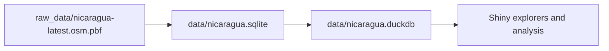

# OSM Nicaragua Data + Shiny Explorers

This project builds and explores OpenStreetMap (OSM) data for Nicaragua using DuckDB and Shiny.

## Quick Start

```r
install.packages(c("shiny", "DBI", "duckdb", "sf", "leaflet"))
source("code/downloadOSMData.R")
shiny::runApp("app.R")
```

Optional Taginfo DB setup:

```r
source("code/downloadTaginfodb.R")
```

## Data Notice

This repository contains code and documentation only. It does not include downloaded OSM extracts or derived DB files.

If you generate those artifacts locally, they are governed by OpenStreetMap's ODbL terms.

## Project Layout

- [code/downloadOSMData.R](code/downloadOSMData.R): pipeline from OSM PBF to SQLite and DuckDB.
- [code/downloadTaginfodb.R](code/downloadTaginfodb.R): downloads and converts Taginfo DB into DuckDB.
- [app.R](app.R): app launcher (opens in external browser when run from RStudio).
- [osm_plot_app.R](osm_plot_app.R): main interactive map/filter/export app.
- [osm_db_explorer_app.R](osm_db_explorer_app.R): schema/table exploration app.
- [osm_tag_explorer_app.R](osm_tag_explorer_app.R): tag exploration across direct columns and `other_tags`.
- [osm_logic_explorer_app.R](osm_logic_explorer_app.R): structure-focused explorer.
- [data/nicaragua.duckdb](data/nicaragua.duckdb): main local analytics database.
- [raw_data/nicaragua-latest.osm.pbf](raw_data/nicaragua-latest.osm.pbf): source extract (local artifact).

## Requirements

R packages:

- `shiny`
- `DBI`
- `duckdb`
- `sf`
- `leaflet`

Pipeline helpers may also use GDAL/OGR (`ogr2ogr`) depending on your ingestion path.

## Build Or Refresh Data

Run the OSM pipeline:

```r
source("code/downloadOSMData.R")
```

Optional: download and convert Taginfo database:

```r
source("code/downloadTaginfodb.R")
```

## Run Main App

Start the main app:

```r
shiny::runApp("app.R")
```

`app.R` forces external browser launch in interactive RStudio sessions to avoid Viewer-specific issues.

## Main App Features ([osm_plot_app.R](osm_plot_app.R))

1. Select any OSM geometry layer containing `WKT_GEOMETRY`.
2. Filter from one source:
   - `Direct column`
   - `other_tags` key/value
   - `Any` (search direct columns + `other_tags` together)
3. Value matching modes:
   - `Contains`
   - `Exact`
4. Boolean expressions in tag value:
   - word operators: `AND`, `OR`
   - symbolic operators: `&`, `||`
   - quoted literals supported (example: `"or"`).
5. Layer stats table (`total_rows`, `matched_rows`, `loaded_rows`).
6. Leaflet rendering by geometry type (points/lines/polygons).
7. GeoPackage export of all filtered matches (not limited by map draw count).
8. Hover help tooltips on sidebar controls.

## Typical Geometry Tables

Depending on import settings, common tables include:

- `points`
- `lines`
- `multilinestrings`
- `multipolygons`
- `other_relations`

## Data Flow


