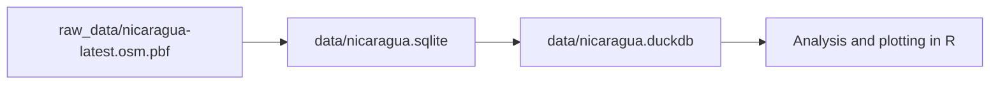

# OSM Nicaragua Data Pipeline

This project downloads OpenStreetMap data for Nicaragua, converts it to a spatial SQLite database, and copies all resulting tables into a DuckDB database for analysis.

Primary script: [downloadOSMData.R](downloadOSMData.R)

## Data Notice

This repository contains code and documentation only. It does not include the downloaded OpenStreetMap extract or the derived SQLite/DuckDB data files.

If you generate those files locally, they are separate data artifacts and should be handled under the terms of the OpenStreetMap License (ODbL), not the code license for this repository.

## What This App Does

1. Downloads the latest Nicaragua OSM extract as PBF.
2. Converts the PBF into spatial tables in SQLite through `ogr2ogr`.
3. Writes a run timestamp to [data/lastupdate.txt](data/lastupdate.txt).
4. Creates or updates [data/nicaragua.duckdb](data/nicaragua.duckdb).
5. Copies all tables from SQLite into DuckDB.
6. Prints the list of tables saved in DuckDB.

## Project Structure

- [downloadOSMData.R](downloadOSMData.R): end-to-end ingestion pipeline.
- [plot_osm.R](plot_osm.R): example visualization and filtering using spatial layers.
- [raw_data/nicaragua-latest.osm.pbf](raw_data/nicaragua-latest.osm.pbf): source OSM file.
- [data/nicaragua.sqlite](data/nicaragua.sqlite): spatial SQLite generated by `ogr2ogr`.
- [data/nicaragua.duckdb](data/nicaragua.duckdb): analytics database with copied tables.
- [data/lastupdate.txt](data/lastupdate.txt): timestamp of the last pipeline run.

## OSM File Structure (Conceptual)

OpenStreetMap stores data in three core element types:

1. Nodes: single coordinate points.
2. Ways: ordered node lists that represent lines or polygon boundaries.
3. Relations: collections of nodes and ways with roles, used for complex features.

Each element can carry tags (key-value attributes), for example:

- `amenity=pharmacy`
- `leisure=park`
- `highway=primary`

In the PBF, this is compact and optimized for transport. In this project, that raw structure is transformed into geometry tables that are easier to query.

## How OSM Relates to SQLite and DuckDB

Step 1: PBF to SQLite

- `ogr2ogr` reads [raw_data/nicaragua-latest.osm.pbf](raw_data/nicaragua-latest.osm.pbf).
- It creates spatial tables in [data/nicaragua.sqlite](data/nicaragua.sqlite), typically:
	- `points`
	- `lines`
	- `multilinestrings`
	- `multipolygons`
	- `other_relations`
- It may also create metadata tables:
	- `geometry_columns`
	- `spatial_ref_sys`
	- `sqlite_sequence`

Step 2: SQLite to DuckDB

- The script attaches [data/nicaragua.sqlite](data/nicaragua.sqlite) inside DuckDB using the sqlite extension.
- It discovers all base tables from the attached SQLite database.
- It copies each table into [data/nicaragua.duckdb](data/nicaragua.duckdb).

This means DuckDB becomes the main analytics store while preserving the same layer structure generated by `ogr2ogr`.

## Data Flow



## Requirements

1. R packages:
	 - `DBI`
	 - `duckdb`
	 - `sf`
	 - `terra`
	 - `ggplot2`
2. Command line tool:
	 - `ogr2ogr` (from GDAL)

## Run

Run the pipeline script:

```r
source("downloadOSMData.R")
```

After completion, confirm outputs exist:

1. [data/nicaragua.sqlite](data/nicaragua.sqlite)
2. [data/nicaragua.duckdb](data/nicaragua.duckdb)
3. [data/lastupdate.txt](data/lastupdate.txt)

## Shiny Map App

An interactive app is available at [app.R](app.R). It reads [data/nicaragua.duckdb](data/nicaragua.duckdb) directly and maps any table that contains `WKT_GEOMETRY`.

Launch it from R:

```r
shiny::runApp("app.R")
```

Features:

1. Layer selector for OSM feature tables.
2. Optional text filter on any attribute column.
3. Dropdown filters for common OSM tags (`amenity`, `highway`, `leisure`) when available.
4. Layer stats panel with total rows, matched rows, and loaded rows.
5. Adjustable max features to render.
6. Interactive Leaflet map plus data preview table.

## Shiny OSM Logic Explorer App

A second app is available at [osm_logic_explorer_app.R](osm_logic_explorer_app.R). It is designed to inspect the internal logic of OSM tables and tags in [data/nicaragua.duckdb](data/nicaragua.duckdb).

Launch it from R:

```r
shiny::runApp("osm_logic_explorer_app.R")
```

Features:

1. Database overview with row counts, number of columns, and flags for geometry/tag fields.
2. Table explorer with schema and sample rows.
3. Summary of direct tag columns when present (`amenity`, `highway`, `leisure`, `place`, `barrier`, `man_made`).
4. Parser for `other_tags` into key-value pairs.
5. Top parsed tag keys and top values per selected key.
6. Search across parsed tag keys and values to inspect hidden tag logic.
7. Tag tree view: tag key -> values -> table/source location with occurrence counts.
8. Wiki reference tab that parses [docs/Map features - OpenStreetMap Wiki.html](docs/Map%20features%20-%20OpenStreetMap%20Wiki.html) and maps observed tag keys to OSM wiki sections.

## Typical Tables in DuckDB

After a successful run, `print(saved_tables)` should include:

- `points`
- `lines`
- `multilinestrings`
- `multipolygons`
- `other_relations`

And metadata/system tables:

- `geometry_columns`
- `spatial_ref_sys`
- `sqlite_sequence`

## Notes on Choosing SQLite vs DuckDB Here

1. SQLite is the import and interchange format produced by `ogr2ogr`.
2. DuckDB is the analysis engine where all tables are consolidated for querying.
3. Keeping both files is useful: SQLite for compatibility, DuckDB for analytics performance.
